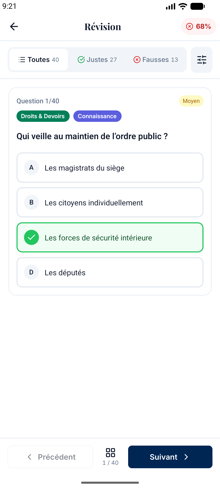
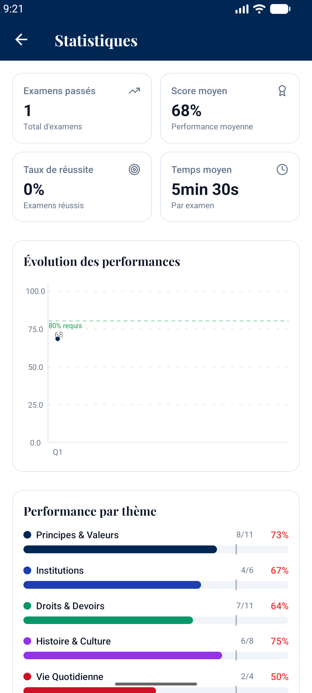
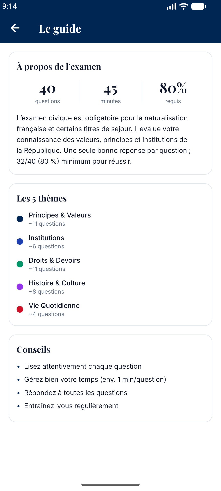

# CiviTest

A French civic-exam quiz trainer for Android, built with React Native and Expo.
It reproduces the real exam conditions: **40 questions, 45 minutes, 80% to pass.**

**Offline by design.** All questions are bundled with the app and quiz history is stored
on-device with SQLite. There are **no accounts, no analytics, and no tracking**, and the
quiz experience makes zero network calls. The only optional network use is a voluntary tip
(see [Support](#support)), which goes through the platform's in-app billing.

> CiviTest is an independent training app. It is not official, affiliated with, or
> endorsed by any government or public authority. Questions are provided for
> practice only.

## Official resources

CiviTest is a practice tool, not an authoritative source. For official information on the
examen civique (format, eligibility, registration, and free government preparation
material), refer to the French Ministry of the Interior:

- [Informations générales sur l'examen civique](https://formation-civique.interieur.gouv.fr/examen-civique/informations-g%C3%A9n%C3%A9rales-sur-lexamen-civique/)
- [Formation civique (site officiel)](https://formation-civique.interieur.gouv.fr/)

## Screenshots

<table>
  <tr>
    <td align="center" width="33%"><br><sub><b>Home</b><br>readiness ring &amp; history</sub></td>
    <td align="center" width="33%"><br><sub><b>Timed quiz</b><br>40 questions, swipe navigation</sub></td>
    <td align="center" width="33%"><br><sub><b>Results</b><br>score &amp; per-theme breakdown</sub></td>
  </tr>
  <tr>
    <td align="center" width="33%"><br><sub><b>Review</b><br>correct / incorrect answers</sub></td>
    <td align="center" width="33%"><br><sub><b>Statistics</b><br>trend &amp; topic performance</sub></td>
    <td align="center" width="33%"><br><sub><b>Exam guide</b><br>themes &amp; tips</sub></td>
  </tr>
</table>

## Features

- Timed exams under real conditions (40 questions / 45 minutes / 80% required)
- 500+ bundled questions across 5 themes, including situational ("mise en situation") questions
- Detailed question-by-question correction after each exam
- Progress tracking: average score, pass rate, evolution over time
- Per-theme statistics to spot weak areas
- Light and dark mode (follows the system theme, or set it manually)
- Optional in-app tip to support development (see [Support](#support))

## Stack

- **Expo SDK 54** + **Expo Router** (file-based navigation)
- **React Native 0.81**, **React 19**
- **NativeWind** (Tailwind for React Native) for styling
- **@tanstack/react-store** + **@tanstack/react-query** for state and caching
- **expo-sqlite** for local quiz-history persistence
- **react-native-gifted-charts** for the stats charts
- **moti** / **reanimated**, **@gorhom/bottom-sheet**, **expo-haptics** for UX
- **zod** for runtime validation of bundled questions and stored quiz history

## Project layout

```
src/
  app/                 # Expo Router routes
    _layout.tsx        #   providers (SafeArea, Query, GestureHandler, BottomSheet) + Stack
    index.tsx          #   Home
    guide.tsx          #   Exam guide / intro
    quiz.tsx           #   Timed quiz (swipe nav, timer, progress sheet, dialogs)
    stats.tsx          #   Stats dashboard (charts + quiz history)
    settings.tsx       #   Settings
    review.tsx         #   Review the just-completed quiz
    review/[quizId].tsx#   Review a historical quiz
  components/          # Timer, QuestionCard, QuizProgress, ResultsSummary, ReviewScreen, ...
    ui/                #   Button, Card, Badge, ConfirmDialog, ProgressBar, Text, ...
    stats/             #   StatsSummaryCards, TrendChart, TopicPerformanceChart, QuizResultsList
    home/              #   Home-screen building blocks
  stores/quizStore.ts  # quiz state machine + scoring (framework-agnostic)
  utils/               # questions.ts (selection/shuffle/format), storage.ts (expo-sqlite)
  lib/                 # queries.ts (bundled question loading), schemas.ts
  hooks/               # useQuizTimer, useQuizStats
  services/            # logger, toast, haptics
  theme/               # design tokens (colors, spacing, type scale)
assets/data/           # 12 bundled question JSON files
```

## Run locally

```bash
npm install
npx expo start        # then open in a dev build, or press "a" for Android
```

Type-check with `npx tsc --noEmit`, and run the unit tests with `npm test`
(Jest, covering the quiz-selection, scoring, validation, storage and contrast logic).

## Build the APK

CiviTest ships as a downloadable APK on **GitHub Releases**. There is no Play
Store deployment. The native `android/` folder is generated and git-ignored, so
regenerate it before building.

**Prerequisites:** JDK 17 and the Android SDK (via Android Studio or the
command-line tools), with `ANDROID_HOME` set.

```bash
npm install
npx expo prebuild --platform android --clean
cd android
./gradlew assembleRelease
```

The APK is written to:

```
android/app/build/outputs/apk/release/app-release.apk
```

Attach that file to a GitHub Release so users can download and install it.

### Alternative: cloud build with EAS

If you'd rather not install the Android toolchain locally, build in the cloud
(requires a free Expo account):

```bash
npm install -g eas-cli
eas login
eas build --platform android --profile preview
```

The `preview` profile in `eas.json` produces an installable APK; download it and
attach it to the release.

## Support

CiviTest is free and has no ads. If you'd like to support development, Settings includes an
optional **"Soutenir CiviTest"** tip (a one-off in-app purchase). This is the app's only
network-touching feature; it is entirely optional and nothing is gated behind it.

Because tips are processed through Google Play billing, they are only available when the app
is installed from the Play Store. On a sideloaded GitHub-Releases APK the tip option is
unavailable, and the app remains fully functional without it.

## Agentic coding

This project was built with an agentic-coding workflow (Claude Code). The setup is
committed so the process is reproducible and visible:

- `.claude/settings.json` enables the Expo plugin used during development.
- `.agents/skills/` vendors the design and React Native skill packs that guided the
  UI and mobile work (`frontend-design`, `make-interfaces-feel-better`,
  `ui-ux-pro-max`, `vercel-react-native-skills`), with `.claude/skills/` symlinking
  into them.
- `skills-lock.json` pins the skill versions.

## License

See [LICENSE](./LICENSE).
